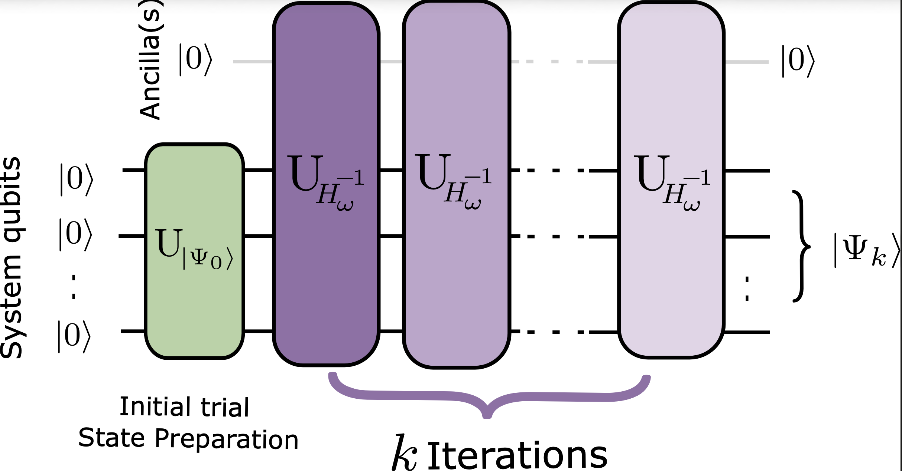

# Efficient targeting of arbitrary excited states with quantum inverse power iteration through filtering polynomials

[](https://arxiv.org/abs/2606.28255)

This repository contains the code for implementing the algorithms developed in this paper:

Srushti Patil and Nina Glaser, *Efficient targeting of arbitrary excited states with quantum inverse power iteration through filtering polynomials*   

We develop a quantum inverse power iteration (QIPI) algorithm using filtering polynomials and quantum singular value transformation (QSVT)[1] for excited-state targeting. The code provides scripts to reproduce numerical results reported in the paper.

<div align="center">
  
</div>


## Installation and Environment Setup

This repository contains figure generation scripts and a local Python package, `nlft_qsp`[2], that is used internally by the QIPI code. A clean setup is:

```bash
git clone <repo-url>
cd NQCP-AA-git-qipi

python -m venv .venv
source .venv/bin/activate

pip install --upgrade pip
pip install -r requirements.txt
pip install pygridsynth
pip install -e .
```

Notes:

- `pip install -e .` is recommended so that the local `nlft_qsp/` package is importable everywhere in the repo.
- `qiskit` is pinned below 2.0: `qiskit-nature` 0.7 (its `ExcitedStatesEigensolver`, used by the chemical simulations) fails to import with qiskit 2.x.
- Some scripts depend on `pygridsynth[3]` for T-count and rotation-decomposition results. If that package is unavailable in your environment, scripts such as `QIPI/pygridsynthplot.py`, `QIPI/qsvt.py`, and the `--rot` data-generation path will not run.

## Repository Layout

```text
NQCP-AA-git-qipi/
├── QIPI/
│   ├── QIPI.py
│   ├── chebyshev_qsp_phase_factors.py
│   ├── chemical_simulations/
│   │   ├── cache_utils.py
│   │   ├── data/
│   │   ├── initial_state_comparison.py
│   │   ├── lih_hamiltonian.py
│   │   ├── prepStateg.py
│   │   └── spectrum_comparison.py
│   ├── combined_polynomial_convergence_cheby.py
│   ├── data/
│   ├── gate_count_vs_amplification.py
│   ├── generate_data.py
│   ├── hamiltonian.py
│   ├── minimax_poly.py
│   ├── pygridsynthplot.py
│   ├── qsvt.py
│   ├── qsvt_poly_transform.py
│   └── query_plot_combined.py
├── nlft_qsp/
├── paper_plots/
├── examples/
├── tests/
├── plotstylefile.mplstyle
├── pyproject.toml
├── requirements.txt
└── readme.md
```

## Core Files

### Main QIPI package

- `QIPI/hamiltonian.py` Builds the molecular Hamiltonians and derived quantities used throughout the paper, including shifted and rescaled operators, target eigenpairs, overlaps, and molecule-specific metadata.
- `QIPI/qsvt.py`
Core QSVT and block-encoding utilities. This file contains the block encoding, QSVT circuit construction, rotation-synthesis variant, and the `rot_decomposition` interface to `pygridsynth`.
- `QIPI/chebyshev_qsp_phase_factors.py`
Computes the eigenvalue-filtering polynomial and extracts QSP/QSVT phase factors used in the QIPI filtering circuits.
- `QIPI/generate_data.py`
Precomputes the main QIPI datasets used by the combined plots. It generates polynomial-evaluation data and iterative convergence data for `H2`, `LiH`, and `BeH2`, both in normal QSVT mode and in rotation-decomposition mode.
- `QIPI/QIPI.py`
Main combined plotting script for the paper’s QIPI results. It reads the cached `.pkl` files from `QIPI/data/` and produces the multi-panel figure for normal mode or rotation-decomposition mode.

### Supporting scientific and plotting scripts

- `QIPI/combined_polynomial_convergence_cheby.py`
Generates the Chebyshev inverse-approximation benchmark plot for a single molecule, showing both the polynomial approximation and iterative convergence.
- `QIPI/qsvt_poly_transform.py`
Visualizes the filtering polynomial transformation and the action of the polynomial on the Hamiltonian eigenvalues.
- `QIPI/gate_count_vs_amplification.py`
Computes logical-resource estimates by comparing T-gate counts against amplification ratios for different polynomial degrees, spectral gaps, and synthesis precisions.
- `QIPI/query_plot_combined.py`
Generates the combined queries-to-accuracy figure across `H2`, `LiH`, and `BeH2`. It can reuse cached query data or recompute it with `--regen`.
- `QIPI/minimax_poly.py`
Plots eigenstate-filtering polynomials and their theoretical and numerical bounds for selected degrees.
- `QIPI/pygridsynthplot.py`
Studies the T-count cost of single-qubit `R_z` synthesis with `pygridsynth` as a function of rotation angle and target precision.

### Chemical simulations (`QIPI/chemical_simulations/`)

- `lih_hamiltonian.py`
LiH at 3 Å (sto3g), parity mapped with two-qubit reduction (10 qubits), target eigenstate 7. Builds the shifted, one-norm-rescaled Hamiltonian, its full spectrum and its singlet / triplet sectors.
- `prepStateg.py`
Builds spin-adapted singlet and triplet configuration state functions (CSFs) directly in the qubit space of a Jordan–Wigner or parity mapper.
- `cache_utils.py`
Disk cache for the expensive diagonalisations, keyed on the mapped qubit operator (and on the shift and scale where they matter).
- `initial_state_comparison.py`
QIPI convergence on LiH from a spin-adapted CSF, a cooled state and a random state.
- `spectrum_comparison.py`
Filtering polynomial over the full Jordan–Wigner spectrum vs the accessible (singlet) spectrum of LiH, and the resulting QIPI convergence.

### Data, styling, and dependencies

- `QIPI/data/`
Cached numerical data used by the figure scripts. The molecule `.pkl` files are produced by `QIPI/generate_data.py`. The `queries_*.pkl` files are produced by `QIPI/query_plot_combined.py`.
- `paper_plots/`
Output directory for generated figures.
- `plotstylefile.mplstyle`
Shared Matplotlib style file used by the plotting scripts.
- `nlft_qsp/`  
External/supporting QSP solver code used for phase-factor generation.
- `tests/`
Tests for the `nlft_qsp` package and related polynomial/QSP routines.

## QIPI Workflow

The main QIPI figures depend on cached data files in `QIPI/data/`. The recommended workflow is:

### 1. Generate the main QIPI datasets

Normal QSVT data:

```bash
python QIPI/generate_data.py
```

Rotation-decomposition data:

```bash
python QIPI/generate_data.py --rot
```

This produces:

- `QIPI/data/H2.pkl`
- `QIPI/data/LiH.pkl`
- `QIPI/data/BeH2.pkl`
- `QIPI/data/H2_with_rot_decompose.pkl`
- `QIPI/data/LiH_with_rot_decompose.pkl`
- `QIPI/data/BeH2_with_rot_decompose.pkl`

These files store:

- sampled polynomial values
- exact-spectrum metadata
- iterative overlap-convergence trajectories
- molecule-specific plotting ranges and parameters

### 2. Generate the main QIPI figures

Normal QSVT combined figure:

```bash
python QIPI/QIPI.py
```

This writes:

- `paper_plots/figure8.pdf`

Rotation-decomposition combined figure:

```bash
python QIPI/QIPI.py --rot
```

This writes:

- `paper_plots/figure10.pdf`

## Individual Figure Scripts

Below is a summary of what each main plotting script does.

### `QIPI/combined_polynomial_convergence_cheby.py`

- Uses a Chebyshev approximation to the inverse.
- Benchmarks the approximation against exact inverse iteration.
- Produces:
  - `paper_plots/figure3.pdf`

### `QIPI/minimax_poly.py`

- Plots filtering polynomials for different degrees at fixed `Δ`.
- Overlays theoretical and numerical bounds.
- Produces:
  - `paper_plots/figure4.pdf`

### `QIPI/qsvt_poly_transform.py`

- Builds the QSVT filtering polynomial for the `H2` setup.
- Shows the polynomial curve and the mapped Hamiltonian eigenvalues.
- Produces:
  - `paper_plots/figure6.pdf`

### `QIPI/QIPI.py`

- Loads precomputed molecule data from `QIPI/data/`.
- Produces the full multi-panel QIPI comparison for `H2`, `LiH`, and `BeH2`.
- Produces:
  - `paper_plots/figure8.pdf` for normal mode
  - `paper_plots/figure10.pdf` for `--rot`

### `QIPI/pygridsynthplot.py`

- Scans rotation angles and synthesis precisions.
- Measures T-count variability for single-qubit `R_z` synthesis.
- Produces:
  - `paper_plots/figure9.pdf`

### `QIPI/gate_count_vs_amplification.py`

- Computes T counts for synthesized QSVT phase rotations.
- Computes amplification ratios from the filtering polynomial response.
- Produces:
  - `paper_plots/figure11.pdf`

### `QIPI/query_plot_combined.py`

- Computes or loads cached queries-to-accuracy curves.
- Uses `QIPI/data/queries_<molecule>.pkl` as a cache.
- Produces:
  - `paper_plots/figure12.pdf`

To recompute the query caches instead of reusing them:

```bash
python QIPI/query_plot_combined.py --regen
```

### `QIPI/chemical_simulations/initial_state_comparison.py`

- LiH, parity mapped, shifted by the mean-field energy of the spin-adapted CSF.
- Left: the filtering polynomial `R_32(x, Δ)` over the spectrum. Right: QIPI convergence from a spin-adapted, a cooled and a random initial state, each with its exact inverse iteration.
- Produces:
  - `paper_plots/figure13.pdf`

### `QIPI/chemical_simulations/spectrum_comparison.py`

- LiH, Jordan–Wigner mapped (12 qubits), target eigenstate 121 (a singlet).
- (a) Filtering polynomial over the full spectrum, (b) over the accessible singlet spectrum only, (c) QIPI convergence: random state on the full spectrum vs spin-adapted CSF on the accessible spectrum.
- Produces:
  - `paper_plots/figure14.pdf`

Both scripts cache their diagonalisations in `QIPI/chemical_simulations/data/` (about 300 MB, not tracked by git). The first run of `spectrum_comparison.py` takes roughly 15 minutes; later runs reuse the cache. They can be run as scripts or as modules:

```bash
python QIPI/chemical_simulations/initial_state_comparison.py
python -m QIPI.chemical_simulations.spectrum_comparison
```

## Cite this work

If you use this repository, please cite the paper and the main supporting references used in the implementation:

- S. Patil and N. Glaser, *Efficient targeting of arbitrary excited states with quantum inverse power iteration through filtering polynomials*, arXiv:2606.28255, 2026. [https://arxiv.org/abs/2606.28255](https://arxiv.org/abs/2606.28255)

## References

1. J. M. Martyn, Z. M. Rossi, A. K. Tan, and I. L. Chuang, *A Grand Unification of Quantum Algorithms*, PRX Quantum 2, 040203 (2021). arXiv:2105.02859. [https://arxiv.org/abs/2105.02859](https://arxiv.org/abs/2105.02859)
2. L. Laneve, C. Sünderhauf `nlft_qsp` package, bundled in this repository under `nlft_qsp/`. GitHub source: [https://github.com/LorenzoLaneve/nlft-qsp](https://github.com/LorenzoLaneve/nlft-qsp)
3. S. Yamamoto and N. Yoshioka, *pygridsynth: A fast numerical tool for ancilla-free Clifford+T synthesis*, arXiv:2604.21333, 2026. [https://arxiv.org/abs/2604.21333](https://arxiv.org/abs/2604.21333)

